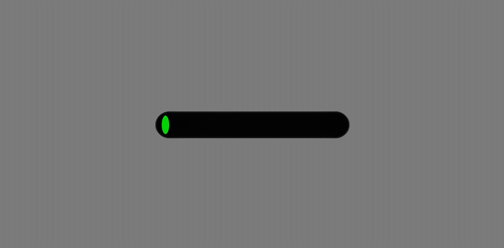

# RealityKit - RKProgressBar

This package provides a simple RealityKit Entity class for creating a geometry to show progress in the form of a capsule.


<!--  -->


## Introduction

Show progress of downloading assets, completion of user actions, or use this class as a health meter in your RealityKit games.

RealityKit doesn't (yet) offer much in the way of creating custom geometries, so I created this class as a way to avoid adding more 3D models to my RealityKit project, and thought others may benefit from it too.

Feel free to offer suggestions or create Pull Requests with new features that you'd like to add to this package.

## Requirements

- Swift 5.1
- iOS 13.0 (RealityKit)

## Example

To create this object and add it to an AnchorEntity in your RealityKit scene graph, simply do the following:

```Swift
func addProgressBar(to anchor: AnchorEntity) {
  let pb = RKProgressBar(startAt: 1.0)
  anchor.addChild(pb)
}
```

To then animate that bar down to a value of 0 with a duration of 3 seconds:
```
  pb.moveProgress(to: 0.0, duration: 10)
```
